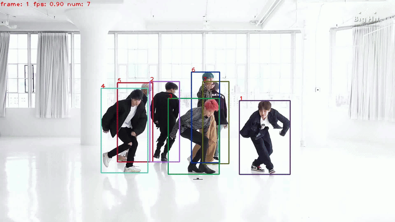

# SOPERM-Track

**SOPERM-Track** is a geometry-driven, **training-free** multi-object tracker based on the principle of **Spatial Object Permanence**. It aims to improve tracking robustness in **crowded scenes, non-linear motion**, and under **severe perspective distortion**.

It is designed by enforcing three physical constraints to recover spatial consistency when visual cues are unreliable:

- **Short-term Height Stability (SHS)**: Stabilizes object scale against detection noise.

- **Ground Contact Distance (GCD)**: Infers relative depth logic from ground contact points.

- **Global Perspective Map (GPM)**: Online learns scene-specific perspective curves to normalize geometric scales.

  SOPERM-Track effectively fixes identity switches caused by occlusion and "near-large, far-small" effects. It is flexible to integrate with various detectors (e.g., YOLOX) and remains **Simple, Online, and Real-time**.

### Pipeline

<center>

</center>

## News

* [01/16/2026]: The code of SOPERM-Track is released.

## Benchmark Performance

| **Dataset**           | **HOTA** | **AssA** | **IDF1** | **MOTA** | **FP** | **FN**  | **IDs** | **AssR** |
| --------------------- | -------- | -------- | -------- | -------- | ------ | ------- | ------- | -------- |
| **MOT17 (test)**      | 63.7     | 64.4     | 78.8     | 78.6     | 16,600 | 102,000 | 1,683   | 68.1     |
| **DanceTrack (test)** | 55.9     | 38.2     | 54.9     | 91.9     | -      | -       | -       | -        |


## Get Started
* See [INSTALL.md](./docs/INSTALL.md) for instructions of installing required components.

* See [GET_STARTED.md](./docs/GET_STARTED.md) for how to get started with SOPERM-Track.

* See [MODEL_ZOO.md](./docs/MODEL_ZOO.md) for available YOLOX weights.

* See [DEPLOY.md](./docs/DEPLOY.md) for deployment support over ONNX, TensorRT and ncnn.


## Demo
To run the tracker on a provided demo video from [Youtube](https://www.youtube.com/watch?v=qv6gl4h0dvg):

```shell
python3 tools/demo_track.py --demo_type video -f exps/example/mot/yolox_dancetrack_test.py -c pretrained/ocsort_dance_model.pth.tar --path videos/dance_demo.mp4 --fp16 --fuse --save_result --out_path demo_out.mp4
```

<center>

</center>
<center>

</center>

<center>

</center>

## Acknowledgement and Citation

The codebase is built highly upon [OC-SORT](https://github.com/noahcao/OC_SORT) and  [ByteTrack](https://github.com/ifzhang/ByteTrack). We thank their wondeful works. SOPERM-TRack, OC-SORT and ByteTrack are available under MIT License. And [YOLOX](https://github.com/Megvii-BaseDetection/YOLOX) uses Apache License 2.0 License.

If you find this work useful, please consider to cite our paper:

